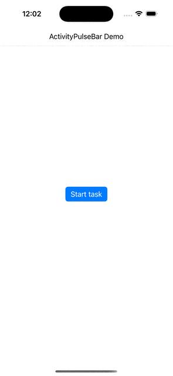

# ActivityPulseBar


ActivityPulseBar is a lightweight and customizable indeterminate loading indicator for iOS, built with Swift.
It mimics the smooth animation style of Android’s indeterminate progress bars, featuring a pulse-like motion of a dynamic bar moving across a track.

Ideal for situations where the exact progress of a task is unknown — ActivityPulseBar provides users with a subtle visual cue that something is happening in the background.




## Features

Horizontal loading bar with a pulse-style animation

The animated segment moves left to right, fades out, and loops

Width and speed evolve over time for a dynamic feel

Easily customizable (colors, size, speed)

Built with Swift 
Zero dependencies

## Installation

You can simply copy the ActivityPulseBar.swift file into your project, or 

Using Swift Package Manager (SPM), enter URL:
```ruby
https://git@github.com/BaptisteSansierra/ActivityPulseBar.git 
```

Using Cocoapods:
```ruby
pod 'ActivityPulseBar'
```

Using Carthage:
```ruby
git "git@github.com:BaptisteSansierra/ActivityPulseBar.git"
```


## Usage

```swift
let pulseBar = ActivityPulseBar()
pulseBar.frame = CGRect(x: 40, y: 100, width: 200, height: 4)
view.addSubview(pulseBar)

// Start the animation:
pulseBar.startAnimating()

// Stop the animation:
pulseBar.stopAnimating()
```

## Inspiration

This component is inspired by the indeterminate Linear Progress Indicator from Material Design, commonly found on Android.

ActivityPulseBar brings a similar UX experience to iOS, with smooth motion and dynamic pacing.

## License

ActivityPulseBar is available under the MIT license. See the LICENSE file for more info.